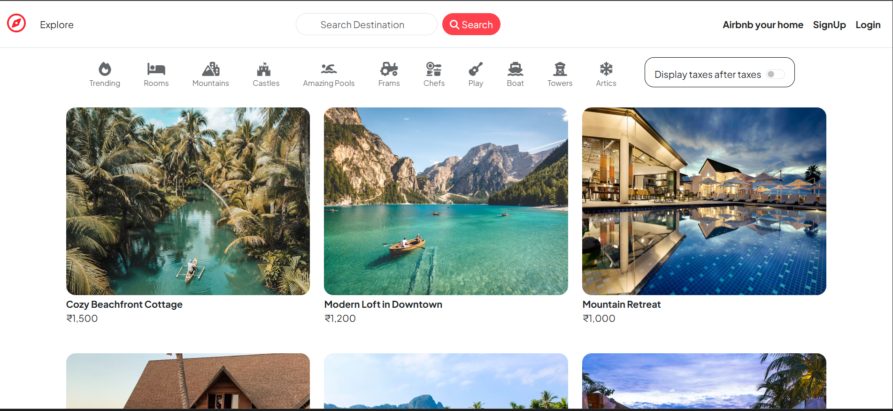
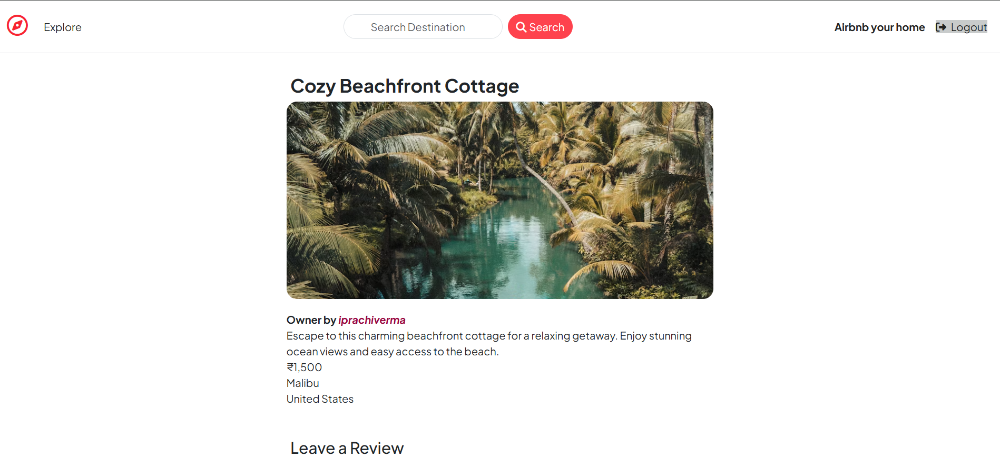
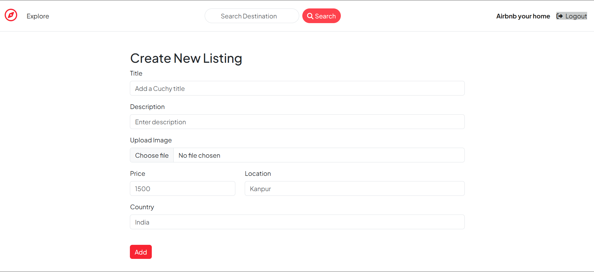
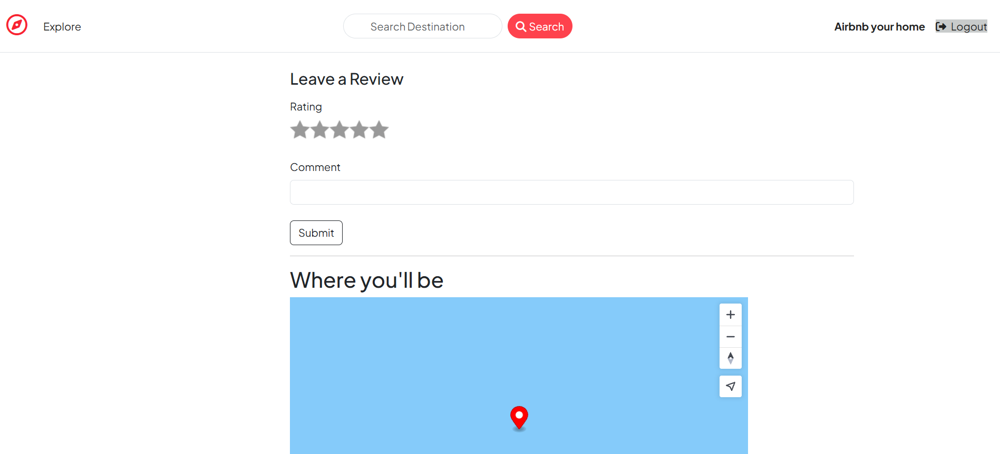
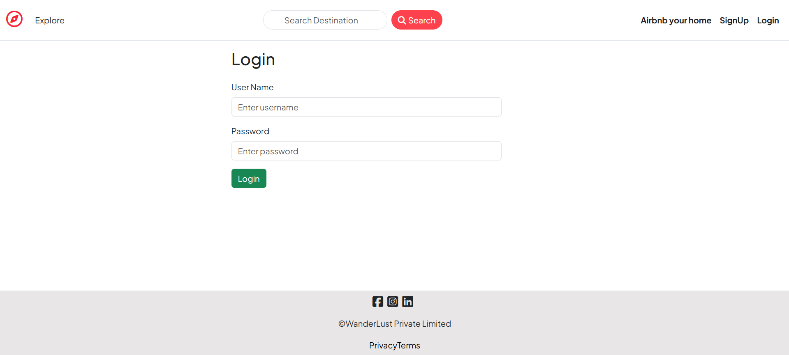
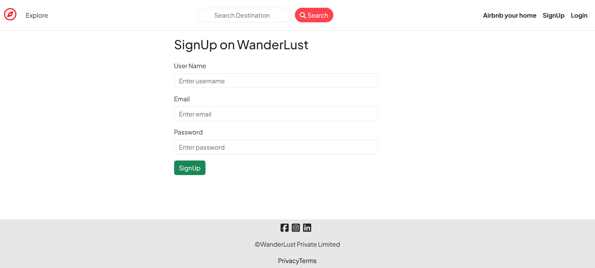

**🌍 Wanderlust**

Wanderlust is a full-stack accommodation booking web application built using Node.js, Express.js, and 
MongoDB. It follows RESTful API design and MVC architecture to implement real-world backend workflows with a
 responsive frontend.

**📑 Table of Contents**

Features

Tech Stack

Project Architecture

Screenshots

Installation & Setup

Future Enhancements

Purpose

**🚀 Features**

• User authentication and authorization

• Create, read, update, and delete property listings

• Reviews and ratings system

• Map integration for property locations

**🛠 Tech Stack**

**Frontend:** HTML, CSS, JavaScript, Bootstrap

**Backend:** Node.js, Express.js

**Database:** MongoDB, Mongoose

**Architecture:** MVC, RESTful APIs

**Tools:** Git, GitHub

**📂 Project Architecture**

The project follows MVC (Model–View–Controller) architecture:

**Models:** MongoDB schemas using Mongoose

**Views:** Server-rendered templates and frontend assets

**Controllers:** Business logic and route handling

**📸 Screenshots**

**⚙️ Installation & Setup**

1. Clone the repository

git clone https://github.com/Prachiverma27/Wanderlust.git

2. Install dependencies

npm install

3. Set environment variables

Create a .env file and add:

MONGO_URI=mongodb://127.0.0.1:27017/wanderlustt

4. Start the server

npm start

**📌 Purpose of the Project**

This project was built to practice full-stack web development, backend architecture, database design, and

 responsive UI using modern JavaScript technologies.

**⭐ Star the Repository**

If you like this project, don’t forget to ⭐ star the repository!